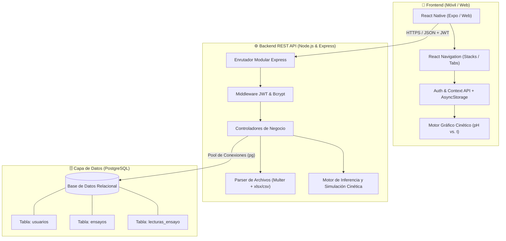
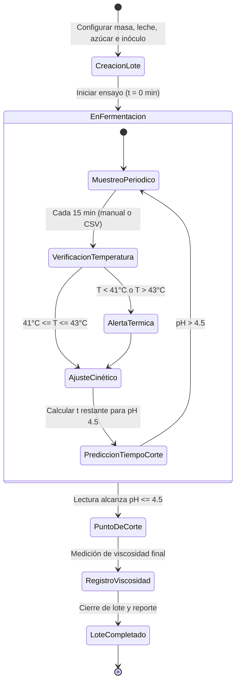
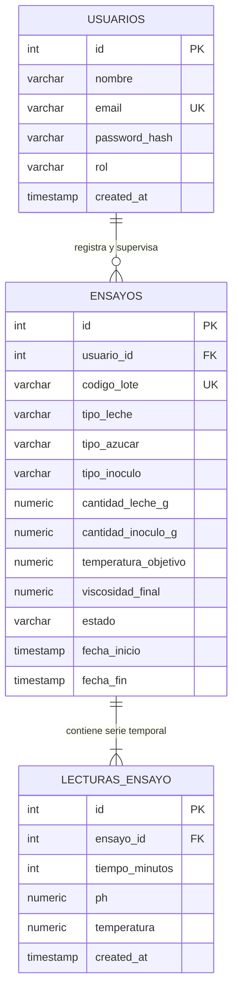

<div align="center">

# 🥛🧪 PrediYogur

### **Sistema Inteligente de Monitoreo, Modelado Cinético y Simulación Predictiva de pH en Fermentación de Yogur**

Plataforma científica y educativa desarrollada para la **Cátedra de Química de Alimentos** y programas de postgrado de la **Facultad de Ciencias de la Vida y Tecnologías** — **Universidad Laica Eloy Alfaro de Manabí (ULEAM)**.

---

[]()
[]()
[]()
[]()
[]()
[]()
[]()

[Características](#-características-principales) • [Fundamento Cinético](#-fundamento-científico-y-cinética-del-proceso) • [Arquitectura](#-arquitectura-del-sistema) • [Base de Datos](#-modelo-de-datos-relacional) • [Instalación](#-instalación-y-puesta-en-marcha) • [API](#-especificación-de-la-api-rest) • [Créditos](#-equipo-académico-y-créditos)

</div>

---

## 📌 Tabla de Contenidos

- [1. Descripción y Propósito](#-1-descripción-y-propósito)
- [2. Fundamento Científico y Cinética del Proceso](#-2-fundamento-científico-y-cinética-del-proceso)
  - [2.1 Dinámica Bioquímica y Sustratos](#21-dinámica-bioquímica-y-sustratos)
  - [2.2 Modelo Matemático de Acidificación](#22-modelo-matemático-de-acidificación)
  - [2.3 Criterio Crítico de Parada (pH 4.5) y Viscosidad](#23-criterio-crítico-de-parada-ph-45-y-viscosidad)
- [3. Características Principales](#-3-características-principales)
- [4. Arquitectura del Sistema](#-4-arquitectura-del-sistema)
  - [4.1 Diagrama de Componentes](#41-diagrama-de-componentes)
  - [4.2 Flujo Operativo del Ensayo](#42-flujo-operativo-del-ensayo)
- [5. Modelo de Datos Relacional (PostgreSQL)](#-5-modelo-de-datos-relacional-postgresql)
  - [5.1 Diagrama Entidad-Relación](#51-diagrama-entidad-relación)
  - [5.2 Esquema DDL SQL](#52-esquema-ddl-sql)
- [6. Estructura del Repositorio](#-6-estructura-del-repositorio)
- [7. Especificación de la API REST](#-7-especificación-de-la-api-rest)
  - [7.1 Endpoints Principales](#71-endpoints-principales)
  - [7.2 Estructura para Carga Masiva (CSV / Excel)](#72-estructura-para-carga-masiva-csv--excel)
- [8. Instalación y Puesta en Marcha](#-8-instalación-y-puesta-en-marcha)
  - [8.1 Prerrequisitos](#81-prerrequisitos)
  - [8.2 Base de Datos Rápida con Docker](#82-base-de-datos-rápida-con-docker)
  - [8.3 Configuración del Backend](#83-configuración-del-backend)
  - [8.4 Configuración del Frontend](#84-configuración-del-frontend)
- [9. Hoja de Ruta (Roadmap)](#-9-hoja-de-ruta-roadmap)
- [10. Equipo Académico y Créditos](#-10-equipo-académico-y-créditos)
- [11. Licencia](#-11-licencia)

---

## 🔬 1. Descripción y Propósito

En la industria de alimentos y la investigación biotecnológica, la fermentación láctica es un proceso sensible a perturbaciones térmicas, fisicoquímicas y de inoculación. Tradicionalmente, los ensayos experimentales en laboratorio se monitorean mediante registros manuales en papel u hojas de cálculo aisladas, lo que dificulta:
1. El cálculo inmediato de la velocidad de acidificación ($\frac{dpH}{dt}$).
2. La anticipación exacta del momento óptimo de corte para evitar la sobreacidificación o la sinéresis del gel.
3. El análisis comparativo sistemático entre matrices convencionales (leche bovina) y matrices no convencionales (leche de chocho —*Lupinus mutabilis*—, coco, almendra, etc.).

**PrediYogur** resuelve esta problemática ofreciendo un entorno digital unificado que combina:
* **Adquisición estructurada de datos cinéticos** (en vivo cada 15 min o mediante importación masiva).
* **Motor predictivo de tiempo restante** para alcanzar el pH objetivo de $4.5$.
* **Módulo pedagógico de simulación *"What-If"*** para evaluar variaciones de temperatura, inóculo y fuentes de carbono.
* **Trazabilidad reológica** registrando la viscosidad final del producto.

---

## ⚙️ 2. Fundamento Científico y Cinética del Proceso

### 2.1 Dinámica Bioquímica y Sustratos

Durante la fermentación, el cultivo láctico iniciador (*Streptococcus thermophilus* y *Lactobacillus delbrueckii subsp. bulgaricus*, modelado experimentalmente mediante inóculo estándar de yogur comercial *Chivería*) consume los azúcares fermentables presentes en el medio para generar ácido láctico:

```
          [Lactosa / Glucosa / Sacarosa]
                       │
                       ▼  (Vía Glucolítica / Fermentación Homoláctica)
                2 Ácido Láctico + Energía (ATP)
                       │
                       ▼
       Liberación de H+ en la fase acuosa
                       │
                       ▼
            Descenso continuo del pH
```

El sistema admite la parametrización de diversas matrices y fuentes de carbono:
* **Matriz Animal:** Leche de vaca entera o descremada (sustrato principal: lactosa).
* **Matrices Vegetales / Andinas:** Extracto acuoso de chocho (*Lupinus mutabilis*), leche de coco u otras bebidas vegetales suplementadas con glucosa o sacarosa.

### 2.2 Modelo Matemático de Acidificación

La curva de descenso de pH sigue un comportamiento sigmoidal inverso, formalizable mediante el **Modelo de Gompertz Modificado**:

$$pH(t) = pH_0 - \Delta pH_{\max} \cdot \exp\left( -\exp\left( \frac{\mu_m \cdot e}{\Delta pH_{\max}} (\lambda - t) + 1 \right) \right)$$

Donde:
* $pH_0$: pH inicial de la mezcla antes de la fermentación ($\approx 6.6 - 6.8$).
* $\Delta pH_{\max}$: Caída máxima de pH estimada durante el ensayo ($pH_0 - pH_{\infty}$).
* $\mu_m$: Velocidad máxima de descenso de pH ($\text{min}^{-1}$ o $\text{h}^{-1}$).
* $\lambda$: Tiempo de fase de latencia o adaptación microbiana (*lag phase*, en minutos).
* $t$: Tiempo transcurrido de fermentación (minutos).

A partir del ajuste continuo de esta función sobre las lecturas registradas, el sistema despeja el valor $t_{\text{corte}}$ donde $pH(t_{\text{corte}}) = 4.5$, calculando el tiempo restante:

$$\Delta t_{\text{restante}} = t_{\text{corte}} - t_{\text{actual}}$$

### 2.3 Criterio Crítico de Parada (pH 4.5) y Viscosidad

* **Punto Isoeléctrico de la Caseína:** Al alcanzar un pH aproximado de **$4.6 - 4.5$**, las micelas de caseína pierden su carga neta negativa y se desestabilizan, coalesciendo en una red tridimensional de gel continuo (coágulo de yogur).
* **Umbral de Parada:** El lote se marca automáticamente como **completado** al llegar a **pH 4.50**. Superar este límite hacia valores menores a $4.2$ desencadena sobreacidificación indeseada y expulsión de suero (sinéresis).
* **Control Térmico Estricto:** La temperatura de referencia se fija en **$42.0\text{ }^\circ\text{C}$**. Cualquier lectura fuera del intervalo **$41.0\text{ }^\circ\text{C} - 43.0\text{ }^\circ\text{C}$** dispara alertas visuales y de estado.
* **Caracterización Reológica:** Justo al alcanzar el punto de corte (pH 4.5), el investigador registra la **viscosidad aparente final** ($\text{cP}$ o $\text{mPa}\cdot\text{s}$), variable clave para determinar la firmeza y calidad de la textura según la formulación.

---

## ✨ 3. Características Principales

| Módulo | Funcionalidades |
| :--- | :--- |
| 🧪 **Gestión de Lotes** | • Registro y parametrización de ensayos con código único.<br>• Selección de matriz: vaca, chocho (*L. mutabilis*), coco, etc.<br>• Dosificación ponderal: masa de leche ($g$ o $ml$) y masa de inóculo ($g$).<br>• Registro del carbohidrato base (lactosa, glucosa, sacarosa). |
| ⏱️ **Adquisición de Datos** | • Captura manual interactiva con temporizador (frecuencia sugerida: 15 min).<br>• Importación masiva de series temporales vía archivo **Excel (`.xlsx`)** o **CSV**.<br>• Validación automática de rangos físicos ($0 \le pH \le 14$, $T > 0\text{ }^\circ\text{C}$). |
| 🚨 **Control de Calidad Térmico** | • Semáforo de advertencia en tiempo real ante fluctuaciones fuera de $41.0\text{ }^\circ\text{C} - 43.0\text{ }^\circ\text{C}$.<br>• Detección de pérdida de calor en baño termostático. |
| 🤖 **Motor Predictivo de pH** | • Algoritmo de extrapolación cinética que predice la hora exacta de llegada a pH 4.5.<br>• Actualización dinámica tras cada nueva toma de muestra. |
| 📈 **Simulación Cinética ("What-If")** | • Comparador gráfico de curvas teóricas vs. reales.<br>• Simulación de escenarios de estrés térmico (ej. fermentación subóptima a $38\text{ }^\circ\text{C}$ vs. $42\text{ }^\circ\text{C}$).<br>• Simulación del impacto de variaciones en la masa de inóculo. |
| 📊 **Reportes y Reología** | • Captura del valor de viscosidad final al corte.<br>• Exportación tabular de datos listos para análisis en R, Python, SPSS o GraphPad Prism.<br>• Trazabilidad completa por investigador y fecha. |

---

## 🏗️ 4. Arquitectura del Sistema

### 4.1 Diagrama de Componentes



### 4.2 Flujo Operativo del Ensayo



---

## 🗄️ 5. Modelo de Datos Relacional (PostgreSQL)

### 5.1 Diagrama Entidad-Relación



### 5.2 Esquema DDL SQL

```sql
-- Habilitar extensión si es requerida
CREATE EXTENSION IF NOT EXISTS "uuid-ossp";

-- 1. Tabla de Usuarios e Investigadores
CREATE TABLE usuarios (
    id SERIAL PRIMARY KEY,
    nombre VARCHAR(100) NOT NULL,
    email VARCHAR(120) UNIQUE NOT NULL,
    password_hash VARCHAR(255) NOT NULL,
    rol VARCHAR(30) DEFAULT 'investigador' 
        CHECK (rol IN ('docente', 'investigador', 'estudiante', 'administrador')),
    created_at TIMESTAMP WITH TIME ZONE DEFAULT CURRENT_TIMESTAMP
);

-- 2. Tabla de Ensayos / Lotes Experimentales
CREATE TABLE ensayos (
    id SERIAL PRIMARY KEY,
    usuario_id INT NOT NULL REFERENCES usuarios(id) ON DELETE CASCADE,
    codigo_lote VARCHAR(50) UNIQUE NOT NULL,
    tipo_leche VARCHAR(60) NOT NULL,           -- 'vaca', 'chocho', 'coco', 'almendra', etc.
    tipo_azucar VARCHAR(60) NOT NULL,          -- 'lactosa', 'sacarosa', 'glucosa'
    tipo_inoculo VARCHAR(100) DEFAULT 'Yogur comercial Chiveria',
    cantidad_leche_g NUMERIC(8,2) NOT NULL CHECK (cantidad_leche_g > 0),
    cantidad_inoculo_g NUMERIC(8,2) NOT NULL CHECK (cantidad_inoculo_g > 0),
    temperatura_objetivo NUMERIC(4,2) DEFAULT 42.00 CHECK (temperatura_objetivo > 0),
    viscosidad_final NUMERIC(8,2) NULL,        -- Medida al llegar a pH 4.5 (cP / mPa.s)
    estado VARCHAR(20) DEFAULT 'en_proceso' 
        CHECK (estado IN ('en_proceso', 'completado', 'cancelado')),
    fecha_inicio TIMESTAMP WITH TIME ZONE DEFAULT CURRENT_TIMESTAMP,
    fecha_fin TIMESTAMP WITH TIME ZONE NULL
);

-- 3. Tabla de Lecturas Periódicas (Series Temporales de pH y Temperatura)
CREATE TABLE lecturas_ensayo (
    id SERIAL PRIMARY KEY,
    ensayo_id INT NOT NULL REFERENCES ensayos(id) ON DELETE CASCADE,
    tiempo_minutos INT NOT NULL CHECK (tiempo_minutos >= 0),
    ph NUMERIC(4,2) NOT NULL CHECK (ph BETWEEN 0.00 AND 14.00),
    temperatura NUMERIC(4,2) NOT NULL CHECK (temperatura > 0),
    created_at TIMESTAMP WITH TIME ZONE DEFAULT CURRENT_TIMESTAMP,
    CONSTRAINT uq_ensayo_tiempo UNIQUE(ensayo_id, tiempo_minutos)
);

-- Índices de optimización para consultas cinéticas frecuentes
CREATE INDEX idx_ensayos_usuario ON ensayos(usuario_id);
CREATE INDEX idx_ensayos_estado ON ensayos(estado);
CREATE INDEX idx_lecturas_ensayo_tiempo ON lecturas_ensayo(ensayo_id, tiempo_minutos ASC);
```

---

## 📂 6. Estructura del Repositorio

El proyecto mantiene una estructura modular y desacoplada monorepo:

```text
PrediYogur/
├── backend/
│   ├── src/
│   │   ├── config/             # Conexión a PostgreSQL (pg pool) y variables de entorno
│   │   ├── controllers/        # Controladores (auth, ensayos, lecturas, predicción)
│   │   ├── middlewares/        # JWT auth, validador de esquemas, errores globales
│   │   ├── models/             # Queries SQL estructuradas y repositorios
│   │   ├── routes/             # Enrutamiento de la API REST (/api/v1/...)
│   │   ├── services/           # Lógica cinética (ajuste de curvas, cálculo t_4.5)
│   │   └── utils/              # Parsers de archivos Excel/CSV y funciones de ayuda
│   ├── .env.example            # Plantilla de variables de entorno
│   ├── package.json
│   └── server.js               # Punto de entrada y configuración del servidor Express
│
├── frontend/
│   ├── src/
│   │   ├── api/                # Cliente Axios con interceptor para tokens JWT
│   │   ├── assets/             # Logotipos, íconos y elementos gráficos
│   │   ├── components/         # Componentes UI (Gráfica cinética, CardLote, AlertaTermica)
│   │   ├── context/            # Proveedores de estado global (AuthContext, LoteContext)
│   │   ├── navigation/         # Navegación por pilas y barras de navegación
│   │   └── screens/            # Pantallas (Login, Dashboard, NuevoEnsayo, DetalleLote, Simulación)
│   ├── App.js                  # Componente raíz
│   ├── package.json
│   └── app.json                # Configuración de Expo / React Native
│
├── docker-compose.yml          # Despliegue rápido de PostgreSQL en desarrollo
└── README.md                   # Documentación principal del sistema
```

---

## 🔌 7. Especificación de la API REST

Todos los endpoints se exponen bajo el prefijo `/api/v1`. La mayoría requiere el encabezado `Authorization: Bearer <token_jwt>`.

### 7.1 Endpoints Principales

| Método | Endpoint | Autenticado | Descripción |
| :--- | :--- | :---: | :--- |
| `POST` | `/api/v1/auth/login` | No | Autenticación de usuario e issue de token JWT |
| `POST` | `/api/v1/auth/register` | Docente/Admin | Registro de nuevo investigador o estudiante |
| `GET` | `/api/v1/ensayos` | Sí | Listado de ensayos del usuario o cátedra |
| `POST` | `/api/v1/ensayos` | Sí | Alta de nuevo ensayo con parámetros iniciales |
| `GET` | `/api/v1/ensayos/:id` | Sí | Detalle completo de un lote con sus lecturas |
| `PATCH` | `/api/v1/ensayos/:id/finalizar` | Sí | Cierre de lote, asignación de `viscosidad_final` |
| `POST` | `/api/v1/ensayos/:id/lecturas` | Sí | Registro de una nueva lectura puntual ($t$, $pH$, $T$) |
| `POST` | `/api/v1/ensayos/:id/importar` | Sí | Carga masiva de lecturas mediante archivo Excel/CSV |
| `GET` | `/api/v1/ensayos/:id/prediccion` | Sí | Proyección cinética y estimación de tiempo hasta pH 4.5 |
| `POST` | `/api/v1/simulador` | Sí | Simulación teórica *"What-If"* dados parámetros de entrada |

### 7.2 Estructura para Carga Masiva (CSV / Excel)

El importador acepta archivos `.csv` y `.xlsx` con la siguiente cabecera estándar:

```csv
tiempo_minutos,ph,temperatura
0,6.72,42.0
15,6.65,42.1
30,6.51,41.9
45,6.30,42.0
60,5.95,41.8
75,5.50,42.0
90,5.10,42.2
105,4.75,41.9
120,4.50,42.0
```

> [!TIP]
> Si durante la importación alguna lectura reporta $T < 41.0\text{ }^\circ\text{C}$ o $T > 43.0\text{ }^\circ\text{C}$, el sistema creará el registro pero marcará una bandera de **advertencia térmica** en el reporte del lote.

---

## 🚀 8. Instalación y Puesta en Marcha

### 8.1 Prerrequisitos

* **Node.js**: Versión `18.x` o `20.x` LTS.
* **PostgreSQL**: Versión `14.x` o superior (o Docker instalado).
* **Gestor de paquetes**: `npm` o `yarn`.
* **Entorno Móvil (opcional para desarrollo nativo)**: Expo Go en dispositivo móvil o emulador Android/iOS.

### 8.2 Base de Datos Rápida con Docker

Si no tienes PostgreSQL instalado localmente, puedes levantar la base de datos con este comando:

```bash
docker run --name prediyogur-db \
  -e POSTGRES_USER=postgres \
  -e POSTGRES_PASSWORD=postgres \
  -e POSTGRES_DB=prediyogur \
  -p 5432:5432 \
  -d postgres:15-alpine
```

### 8.3 Configuración del Backend

1. **Ingresar a la carpeta y descargar dependencias:**
   ```bash
   cd backend
   npm install
   ```

2. **Configurar variables de entorno:**
   ```bash
   cp .env.example .env
   ```
   Ajusta los valores en el archivo `.env`:
   ```env
   PORT=5000
   NODE_ENV=development
   DB_HOST=localhost
   DB_PORT=5432
   DB_USER=postgres
   DB_PASSWORD=postgres
   DB_NAME=prediyogur
   JWT_SECRET=super_clave_secreta_uleam_2026
   JWT_EXPIRES_IN=24h
   ```

3. **Ejecutar migraciones / esquema inicial:**
   ```bash
   psql -h localhost -U postgres -d prediyogur -f src/models/schema.sql
   ```

4. **Iniciar en modo desarrollo:**
   ```bash
   npm run dev
   ```
   El backend estará disponible en `http://localhost:5000`.

### 8.4 Configuración del Frontend

1. **Ingresar a la carpeta y descargar dependencias:**
   ```bash
   cd ../frontend
   npm install
   ```

2. **Configurar URL base de la API:**
   Verifica en `src/api/client.js` que apunte a la IP de tu servidor backend:
   ```javascript
   export const API_BASE_URL = 'http://localhost:5000/api/v1'; // o tu IP local en red LAN
   ```

3. **Ejecutar la aplicación:**
   ```bash
   npm start
   # o bien: npx expo start --web para visualización inmediata en navegador
   ```

---

## 🗺️ 9. Hoja de Ruta (Roadmap)

- [x] Modelado relacional y esquema cinético inicial.
- [x] Motor de inferencia y cálculo de tiempo restante a pH 4.5.
- [ ] Implementación de integración continua (CI/CD) con GitHub Actions.
- [ ] Módulo de exportación directa a reportes en **PDF** con firma del investigador.
- [ ] Integración con hardware IoT (microcontrolador ESP32 + sonda analógica de pH y sensor sumergible DS18B20 para telemetría en tiempo real).
- [ ] Modelos de Machine Learning (Random Forest / Redes Neuronales) para predicción multivariable considerando viscosidad y sólidos solubles (°Brix).

---

## 👥 10. Equipo Académico y Créditos

* **Director / Patrocinador de Investigación:**  
  **Ing. Stalin Gustavo Santacruz Terán, PhD.**  
  Docente Investigador — Cátedra de Química de Alimentos  
  Facultad de Ciencias de la Vida y Tecnologías  
  *Universidad Laica Eloy Alfaro de Manabí (ULEAM)*

* **Líder de Desarrollo y Repositorio:**  
  **Carlos Santana (Carlos-73CK)**  
  Facultad de Ciencias de la Vida y Tecnologías / Ingeniería de Software — *ULEAM*

* **Entorno Académico:**  
  Proyecto desarrollado en vinculación con la docencia, investigación de pregrado y programas de maestría en Ciencia y Tecnología de Alimentos.

---

## 📄 11. Licencia

Este software se distribuye bajo fines estrictamente académicos, científicos y de investigación formativa para la **Universidad Laica Eloy Alfaro de Manabí (ULEAM)**.

Todos los derechos reservados © 2026.